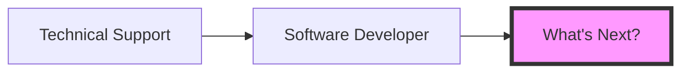

# 
👋 Hi, I'm Iris!

  

## 💻 About Me

Backend enthusiast with a passion for building robust systems that power the web! 
I've had a career in IT since 2010, starting in technical support and evolving into a software developer.

> "Know how to learn. Then, want to learn." - Katherine Johnson

## 🔧 Tech Toolbox

### Languages

### Frameworks & Tools

## 🚀 Career Journey

## 💼 What I Do

- **Backend Development**: Building the engines that power applications
- **Systems Architecture**: Designing robust, scalable solutions
- **Tool Creation**: Crafting utilities that make End Users' lives easier
- **Problem Solving**: Turning complex challenges into elegant solutions

## 🌟 Fun Facts

- 💡 I learned C++ from a popular MMORGP at 13
- ☕ My Gaggia Pro is my pride & joy
- 🔍 Love diving deep into the next puzzle
- 🛠️ Enjoy creating developer tools that boost productivity

## 📫 Let's Connect

  
  
  
  
  

